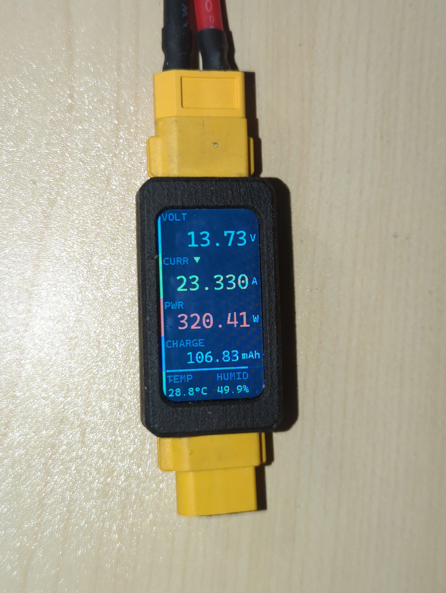
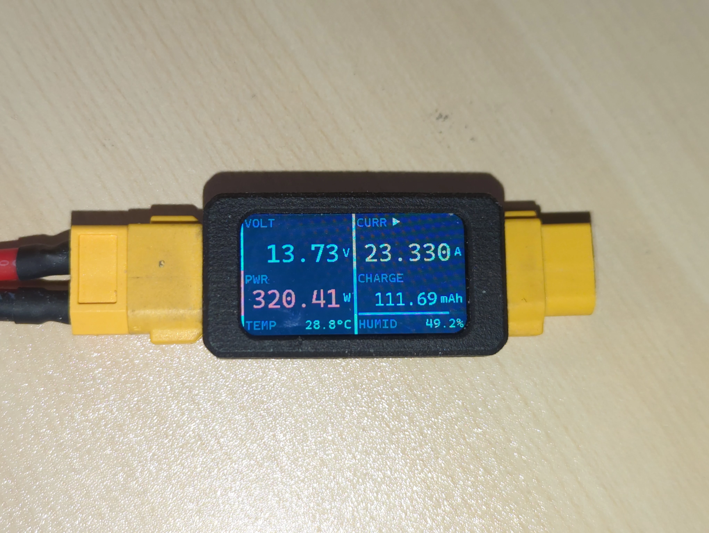
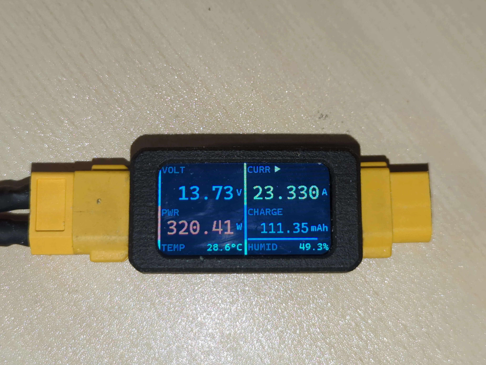
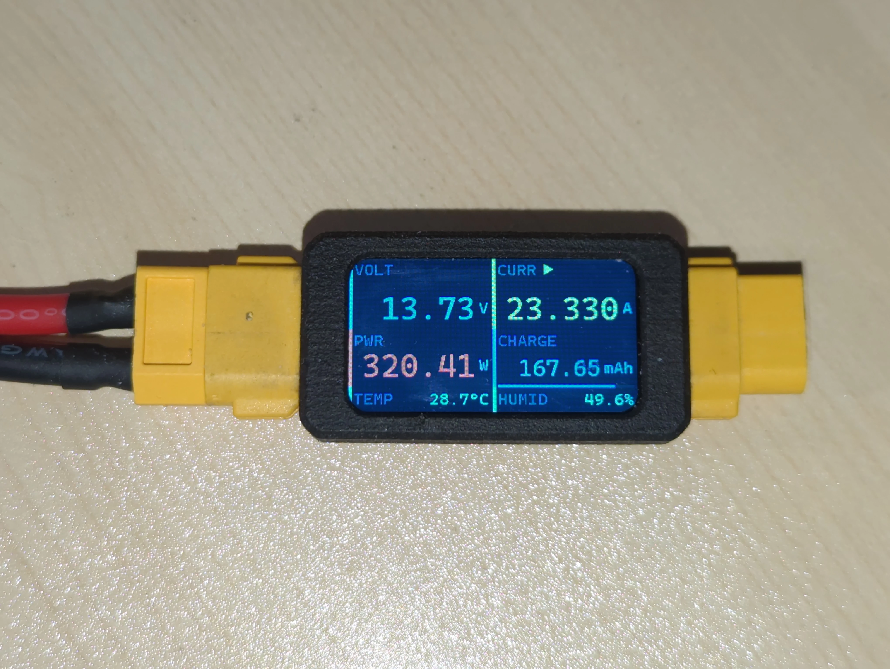
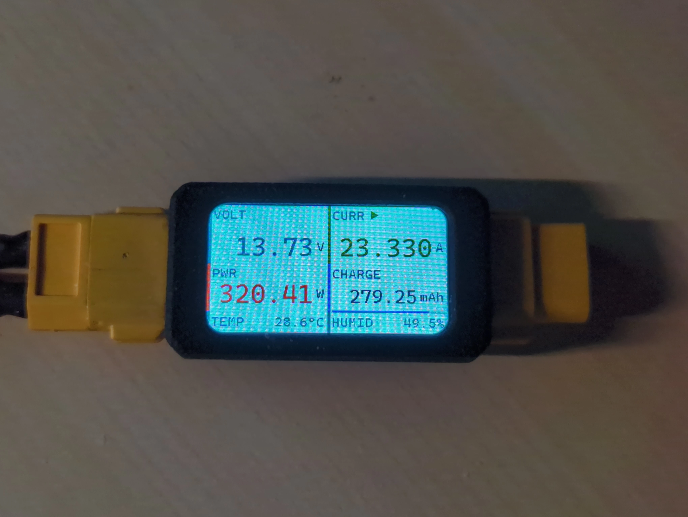

# OpenPM01

Free/Libre and open-source firmware for the **FRME-PM-01A** power meter.

> **Hardware notice:** The
> [FRME-PM-01A](https://oshwhub.com/frostautumn/frme-pm-01a-ky) hardware is
> designed by [@FrostAutumn](https://oshwhub.com/frostautumn) and licensed under
> **CC-BY-NC-SA 3.0**. OpenPM01 is an independent firmware project and is **not
> affiliated with nor endorsed by** the original hardware project.

## Features

- Real-time voltage, current, power, coulomb counter (mAh), temperature, and
  humidity
- Coulomb integration via trapezoidal rule
- Battery state-of-charge gauge (voltage-to-percentage lookup with progress bar,
  low-voltage warning)
- Visual alerts (blinking) for under/over-voltage, over-current, and temperature
  limits
- High refresh rate
- Four orientation modes: portrait, portrait 180° flipped, landscape,
  landscape flipped
- Built on [libopencm3](https://github.com/libopencm3/libopencm3) — no STM32
  HAL, no proprietary blobs, fully free-software stack
- [Catppuccin](https://github.com/catppuccin/catppuccin) color themes (Mocha /
  Macchiato / Frappé / Latte)

## Screenshots

### Portrait / Landscape

Both orientations support 180° flip for flexible panel mounting.

| Portrait | Landscape |
|----------|-----------|
|  |  |

### Color themes

| Mocha | Macchiato |
|-------|-----------|
|  |  |

| Frappé | Latte |
|--------|-------|
|  |  |

## Build

```bash
# Requires PlatformIO
platformio run

# Upload via CMSIS-DAP
platformio run --target upload
```

### Orientation

Pick exactly one orientation flag in `build_flags` (default: `UI_PORTRAIT`):

```ini
-DUI_PORTRAIT           # portrait
-DUI_PORTRAIT_FLIP      # portrait 180° flipped
-DUI_LANDSCAPE          # landscape
-DUI_LANDSCAPE_FLIP     # landscape flipped
```

### Color theme

```ini
-DCATPPUCCIN_MOCHA
-DCATPPUCCIN_MACCHIATO
-DCATPPUCCIN_FRAPPE
-DCATPPUCCIN_LATTE
```

### Battery gauge

Enabled by default with 4S LiFePO₄ profile. Switch profile or disable:

```ini
-DBATTERY_4S_LIFEPO4    # 4S LiFePO₄ (default, can be omitted)
-DNO_BATTERY            # disable battery gauge entirely
```

Add new battery profiles by adding an `#elif` block in `common.h` that defines
`bat_lut`, `BAT_LUT_LEN`, and `BAT_LO_V`.

## Pin Map

| Function | Pin | Peripheral |
|---------------------|-----|-----------------|
| ST7789 SDA (MOSI) | PA6 | Software SPI |
| ST7789 SCL (SCK) | PA7 | Software SPI |
| ST7789 DC | PA4 | GPIO |
| ST7789 RST | PA5 | GPIO |
| ST7789 CS | PA3 | GPIO |
| ST7789 BLK | PA2 | GPIO (active-low) |
| INA226 SDA | PB7 | I2C1 |
| INA226 SCL | PB6 | I2C1 |
| SHT30 SDA | PB8 | Software I2C |
| SHT30 SCL | PB9 | Software I2C |

## Project Structure

```
src/
├── main.c                   Scheduler + init
├── ui.c                     UI rendering
├── sensors.c                INA226 + SHT30 data hub
├── ina226.c                 Hardware I2C1 driver
├── sht30_sm.c               SHT30 state machine
├── st7789_stm32_spi.c       Display driver (software SPI)
└── fonts/                   11× Cascadia Code Nerd Font (18–38 px)

include/
├── common.h                 Constants, colors, helpers
├── ui.h                     Display API
├── sensors.h                Sensor accessor API
├── colour.h                 Catppuccin theme palette
├── ina226.h
├── sht30_sm.h
├── st7789_stm32_spi.h
└── fonts/                   Font headers + bitmap_typedefs.h
```

## Credits

**Hardware**

This firmware targets the
[FRME-PM-01A](https://oshwhub.com/frostautumn/frme-pm-01a-ky) hardware designed
by [@FrostAutumn](https://oshwhub.com/frostautumn), licensed under CC-BY-NC-SA 3.0.

**Open-source dependencies**

| Component | Author | License |
|-----------|--------|---------|
| [stm32f1_st7789_spi](https://github.com/abhra0897/stm32f1_st7789_spi) | Avra Mitra | [MIT](https://opensource.org/licenses/MIT) |
| [INA226 library](https://github.com/RobTillaart/INA226) | Rob Tillaart | [MIT](https://opensource.org/licenses/MIT) |
| [SHT30 library](https://github.com/libdriver/sht30) | LibDriver | [MIT](https://opensource.org/licenses/MIT) |
| [libopencm3](https://github.com/libopencm3/libopencm3) | libopencm3 project | [LGPLv3](https://www.gnu.org/licenses/lgpl-3.0.html) |
| [Caskaydia Cove](https://github.com/eliheuer/caskaydia-cove) (Cascadia Code fork) | Eli Heuer / Microsoft | [SIL OFL 1.1](https://scripts.sil.org/OFL) |

## License

OpenPM01 firmware is released under **[GNU GPLv3](LICENSE)**.

### Hardware license notice

The [FRME-PM-01A](https://oshwhub.com/frostautumn/frme-pm-01a-ky) hardware
design is licensed under **CC-BY-NC-SA 3.0** by
[@FrostAutumn](https://oshwhub.com/frostautumn). The original author has
additionally expressed an intent to restrict unauthorized derivatives beyond
what the SA clause itself requires.

OpenPM01 was written entirely from scratch and does not reference the original
hardware project's firmware, which has not been open-sourced.


GPLv3 grants you the freedom to use, modify, and distribute this firmware,
provided you comply with its terms. However, the GPLv3 license governs this
firmware only. If you intend to use this firmware commercially or in any derived
work, note that the **hardware design** remains subject to its CC-BY-NC-SA 3.0
terms — please ensure compliance with the original hardware license
independently.

